# pix2code_improvement
## Abstract
This is a continuation of the pix2code project by Tony Beltramelli (https://github.com/tonybeltramelli/pix2code) where he identifies the code base used to create graphical interfaces given pictures of those graphical interfaces. In the project we show how to improve the accuracy and reach (almost) 100% correctly code reconstruction. The main motivation of the project was to learn and practice RNN and CNN architectures in Tensorflow, and can hopefully serve as examples/tutorial for other developers/data scientists.

## Problem setup and report outline
The pix2code solution by Tony Beltramelli concerns taking a picture of a graphical interface (web, ios or android-based) and reconstruct the the high level code used to create it. In his article "pix2code: Generating Code from a Graphical User Interface Screenshot" (https://arxiv.org/pdf/1705.07962.pdf) he showed an approach to this problem where he reached 75-90% accuracy on reconstructing code. The dataset used was simulated web sites with only a limited kind of code structures and words, but still interesting as a proof of concept. 
Putting more time into the neural network architectures used, and with the advancements in the field, we have however managed to improve the results to perfect predictions. Moreover, using the Tensorflow architectures proposed in the Tensorflow addonds library, we have been able to improve the prediction speed by a factor of 100. We have chosen to continue with the same simulated dataset provided by Beltramelli, but the models are expected to generalize to wider vocabularies.

The approach we have used is to first identifying the causes why the existing architecture does not reach 100% and create a subproblem where we can test only that part of the neural network. Once we have a solution there we then rewrite the codebase to accommodate the Tensorflow addons seq2seq library setup. This allows significant improvement in speed, and easy usage of the latest advancements in the field such as ebmedders, attention mechanisms, beam search, etc. We then incrementally try out new architectures, identifying where they fail and how to improve, until we reach one with a validation error of 0.

The rest of the readme/report is structured as follows; In section 1 we cover a summary of the report, including limitations, accuracy reached by each model etc. In section 2 we then describe the setup used, versions used etc and what is needed to run it. In section 3 we then describe how we "solved" the problem by describing the models in detail, including their architectures and what their results indicated (next steps).

## 1. Summary

### Goals of the project
* Improve the accuracy of the pix2code problem solution
* Rewrite the pix2code solution into a Tensorflow 2.0 and Tensorflow addons RNN setup
* Study if the CNN image layer output can be used for object detection / image segmentation

### Limitations and boundaries
For initial studies only the web dataset will be used. We also alter the dataset slightly by removing newlines and spaces from the code, since these are not visible in the interface and unimportant for the final outcome of the interface.

### Results
High level results are shown in the table below. For detailed model description, see section 3.

| model_name                        | dataset   |       error |   correctly_predicted | Notes/advantages/disadvantages   |
|:----------------------------------|:----------|------------:|----------------------:|:---------------------------------|
| pix2code_original_model           | train     | 0.00591804  |              0.946706 | Slow to train, slow to predict                                 |
| pix2code_original_model           | valid     | 0.0108029   |              0.894118 |                                  |
| pix2code_original_model           | test      | 0.0126051   |              0.882353 |                                  |
| shallow_image_model               | train     | 4.47279e-05 |              0.99852  | Fast predictions (no RNN), Unlikely to provide compilable code |
| shallow_image_model               | valid     | 0.0132742   |              0.705882 |                                  |
| shallow_image_model               | test      | 0.0154005   |              0.729412 |                                  |
| rnn_image_model_repeat            | train     | 0           |              1        | Fast to train (using transfer learning), slow to predict |
| rnn_image_model_repeat            | valid     | 0.00419117  |              0.917647 |                                  |
| rnn_image_model_repeat            | test      | 0.00749442  |              0.870588 |                                  |
| rnn_image_model_memory            | train     | 0           |              1        | Fast to train (using transfer learning), slow to predict |
| rnn_image_model_memory            | valid     | 0.00655838  |              0.9      |                                  |
| rnn_image_model_memory            | test      | 0.00804635  |              0.905882 |                                  |
| rnn_image_model_tfa               | train     | 0           |              1        | Fast to predict |
| rnn_image_model_tfa               | valid     | 0.00479369  |              0.935294 |                                  |
| rnn_image_model_tfa               | test      | 0.00546907  |              0.923529 |                                  |
| rnn_image_model_tfa_repeat        | train     | 8.60689e-06 |              0.99926  | Fast to predict |
| rnn_image_model_tfa_repeat        | valid     | 0.00329891  |              0.947059 |   |
| rnn_image_model_tfa_repeat        | test      | 0.00286749  |              0.964706 |                                  |
| rnn_image_model_tfa_repeat_bypass | train     | 0           |              1        |  Fast to predict, 100% validation accuracy |
| rnn_image_model_tfa_repeat_bypass | valid     | 0           |              1        |                                  |
| rnn_image_model_tfa_repeat_bypass | test      | 0           |              1        |                                  |

### Continuation of the project
If there are any developers out there with their own, even better, solutions, we are eager to hear your ideas. Also, if you have a similar problem (possibly a bit more advanced), please let us know and we will link it!

## 2. Setup
For this project we used the following setup:
* Tensorflow 2.1
* Tensorflow-addons 0.8.3
* The platform was an Ubuntu 19.10, using CUDA 10.1, with an Nvidea GTX 1070 GPU

To run the code and test the models, please follow the code in the tensorflow_improvement_notebook.ipynb. 

## 3. Models and approach
### 3.1 Original pix2code model
The architecture of the pix2code model proposed by Beltramelli looks as follows (for the web page interface domain with 17 words in the vocabulary). Recall that the LSTM layers are recurrent and can be unravelled per timestep (48 in this case).
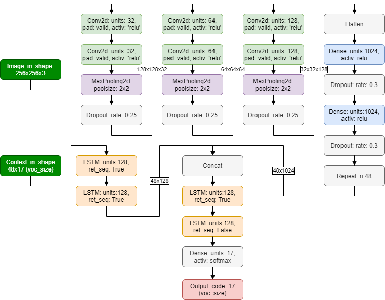

The results of the model, trained on the training set until the validation error increased, is shown below:

| dataset   |      error |   correctly_predicted |   same_length |   active_button_correct |   button_color_correct |
|:----------|-----------:|----------------------:|--------------:|------------------------:|-----------------------:|
| train     | 0.00591804 |              0.946706 |      0.983716 |                0.987417 |               0.959289 |
| valid     | 0.0108029  |              0.894118 |      0.947059 |                1        |               0.894118 |
| test      | 0.0126051  |              0.882353 |      0.941176 |                0.988235 |               0.894118 |

The columns are as follows: 
* Error: The levenshtein distance (on word level) from the correct code to the predicted code. Lower is better.
* Correctly predicted: The ratio of completely correctly predicted samples (i.e. interfaces/images)
* Same length: The ratio of samples that has the right length of the code (i.e. the right number of words)
* Active button correct: The ratio of samples where the active button/inactive buttons are found correctly
* Button color correct: The ratio of samples where the color of the buttons are found correctly

The latter three columns make more sense at a later stage when the predictions approach 100%.

To improve the model the problem was split into separate pieces that could be approached and tested independently of eachother. The first being the CNN part, i.e. whether or not the convolutional neural net were able to capture all the objects in the image, and secondary the RNN part to order them all together. The former is presented in the next subsection, while the latter in the remanding subsections.

### 3.2 CNN models
To test whether the CNNs could capture the objects in the images the problem was rewritten into a counting problem. I.e. for each image, the goal was to count how many instances there were of the different objects/words (red-buttons, rows, active-buttons, square_brackets etc). The idea was that if the CNN were able to capture this completely, the RNN part only had to focus on the ordering of the objects.

The architecture of the original CNN model can be seen below. Note that it can be argued whether or not all the dense layers should be there or not (i.e. whether they belong to the RNN part or the CNN part). For this model, and the results below, they were however included)
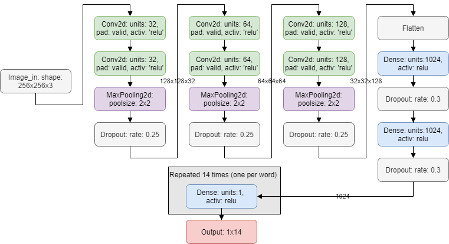

Possible main weaknesses in the architecture were identified as the maxpooling layyers, as well as the many dense layers following the cnn layers. Hence the maxpooling layers were replaced by using strides in the convolutional layers, outputting one independent feature map per object word (such as red-button, green-button), each 64x64 (unlike previous 32x32). These were then followed by a shared counting unit counting the number of indicated objects in the images. The architecture is hence as follows:
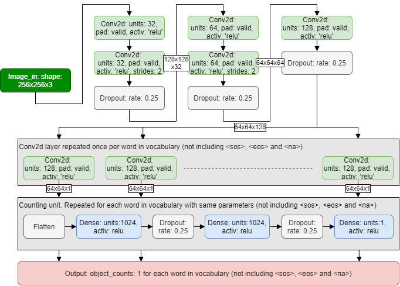

The changes gave the intended results as seen below where the new "shallow cnn model" have 100% accuracy:

| model              | dataset             |   btn-active_count |   btn-green_count |   btn-inactive_count |   btn-orange_count |   btn-red_count |   close_square_bracket_count |   double_count |   header_count |   quadruple_count |   row_count |   single_count |   small-title_count |   square_bracket_count |   text_count |
|:-------------------|:--------------------|-------------------:|------------------:|---------------------:|-------------------:|----------------:|-----------------------------:|---------------:|---------------:|------------------:|------------:|---------------:|--------------------:|-----------------------:|-------------:|
| original_cnn_model | train_accuracy      |                  1 |          0.997039 |              0.99926 |           0.993338 |        0.994078 |                     0.994819 |       0.980015 |              1 |          0.988157 |           1 |       0.994078 |            0.995559 |               0.994819 |     0.994078 |
| original_cnn_model | validation_accuracy |                  1 |          0.994118 |              1       |           1        |        0.994118 |                     0.994118 |       0.982353 |              1 |          0.976471 |           1 |       0.994118 |            0.994118 |               0.988235 |     0.994118 |
| original_cnn_model | test_accuracy       |                  1 |          0.994118 |              1       |           0.994118 |        1        |                     0.994118 |       0.976471 |              1 |          0.982353 |           1 |       0.994118 |            1        |               0.994118 |     0.994118 |
| shallow_cnn_model  | train_error         |                  1 |          1        |              1       |           1        |        1        |                     1        |       1        |              1 |          1        |           1 |       1        |            1        |               1        |     1        |
| shallow_cnn_model  | validation_error    |                  1 |          1        |              1       |           1        |        1        |                     1        |       1        |              1 |          1        |           1 |       1        |            1        |               1        |     1        |
| shallow_cnn_model  | test_error          |                  1 |          1        |              1       |           1        |        1        |                     1        |       1        |              1 |          1        |           1 |       1        |            1        |               1        |     1        |

An interesting gain following this were that it was easy to inspect what the RNN-part of the model later "saw" by looking at the output of the final convolutional layer. An example of this is shown below, but it is also more clear using the later models. One can note that especially the buttons are shown very clearly in the images.
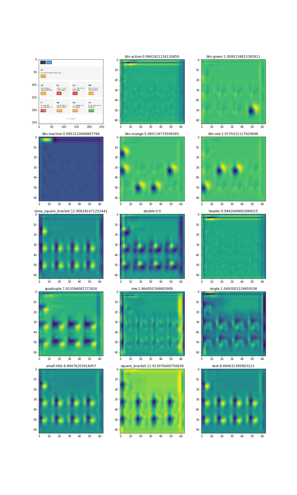

### RNN models
With the CNN part able to capture the dynamics in the images, the RNN part went through several stages. This was done both to gradually see how the different architectures altered the behaviour of the models, but also to be able to use transfer learning from one model to the next. 

#### Image model
The (shallow) image model is the natural next step from the CNN model. Its architecture can be seen below, and it is very close to that of the shallow cnn model, with some dense layers added to order the convolutional layer output. 
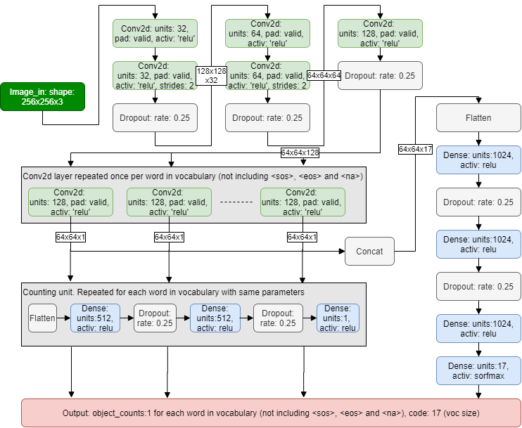

Its results can be seen below and it can be noted that it overfits quite a bit. Apart from that it can also be noted that it is mainly the color of the buttons that causes issues. It should be noted that the model is quite fast though.

| dataset   |       error |   correctly_predicted |   same_length |   active_button_correct |   button_color_correct |
|:----------|------------:|----------------------:|--------------:|------------------------:|-----------------------:|
| train     | 4.47279e-05 |              0.99852  |      1        |                0.99852  |               0.99852  |
| valid     | 0.0132742   |              0.705882 |      0.958824 |                0.888235 |               0.735294 |
| test      | 0.0154005   |              0.729412 |      0.952941 |                0.888235 |               0.758824 |

#### Image model repeat
In the second model the same approach were used as proposed by Beltramelli in the sense of repeating the image output for each of the LSTMCells (i.e. each unravelled instance of the LSTM layers). This reminds a bit of the attention models used by Xu et al. https://arxiv.org/pdf/1502.03044.pdf but without the actual attention mechanism. For the image part of the model the image model above was however used. The architecture of the model can be seen below:
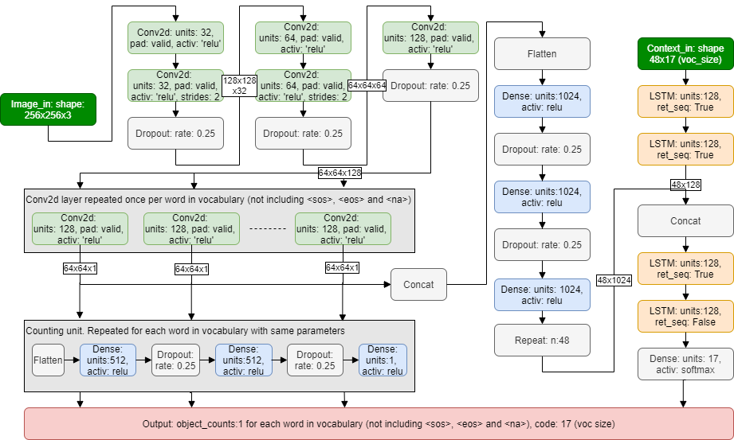

The results achieved were as follows. The results are now considerably better than those of the original pix2code model, but there is still some way to go. Moreover, using the model for prediction is quite slow due to that a new prediction has to be made for each word in the output. (i.e. if the code has 45 different words, 45 different predictions has to be made with updated input (context) for each prediction.

| dataset   |      error |   correctly_predicted |   same_length |   active_button_correct |   button_color_correct |
|:----------|-----------:|----------------------:|--------------:|------------------------:|-----------------------:|
| train     | 0          |              1        |      1        |                1        |               1        |
| valid     | 0.00419117 |              0.917647 |      0.988235 |                0.982353 |               0.917647 |
| test      | 0.00749442 |              0.870588 |      0.976471 |                0.970588 |               0.870588 |

#### Image model memory
The classical architecture for seq2seq models is not the repeated architecture as of the model above, but instead to use a encoder-decoder architecture. In such a model one has a encoder (in this case the shallow CNN model) that provides the encoded information to the decoder (the RNN) as its initial memory. The RNN then outputs the relevant words using its memory. Hence such an architecture was also tested, as can be seen below:

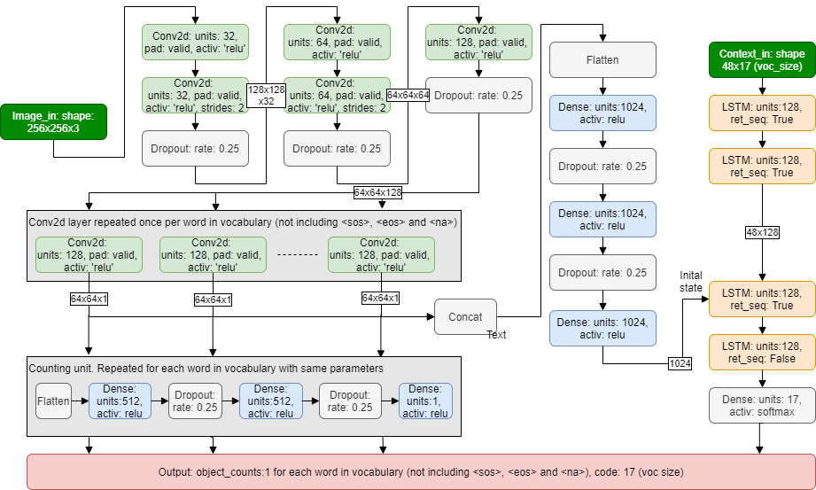

The results can be seen below as sligtly worse than with the repeat model:

| dataset   |      error |   correctly_predicted |   same_length |   active_button_correct |   button_color_correct |
|:----------|-----------:|----------------------:|--------------:|------------------------:|-----------------------:|
| train     | 0          |              1        |      1        |                1        |               1        |
| valid     | 0.00655838 |              0.9      |      0.964706 |                0.994118 |               0.9      |
| test      | 0.00804635 |              0.905882 |      0.964706 |                1        |               0.905882 |

#### Image model TFA (memory)
As noted above a weakness with the earlier RNN models were that the prediction took quite some time. Moreover, not using the latest framework for seqence models also prohibited the access to more advanced features of these such as attention mechanisms, beam search, embeddings etc. To solve this the models were reimplemented in a Tensorflow addons seq2seq architecture. This is similar to the architecture of the models so far, but where the RNN part is done slightly different. Instead of using LSTM layers, one defines only the cells (i.e. the basic cell that is repeated in an LSTM) and then uses specialized decoders that dictate how the RNN unravels. One also has to provide samplers that dictates what the input should be to the cells for each timestep (i.e. should it be taken from the provided context, or should it be recursively given). Most of these parts have ready implementations, but in this case the sampler had to be altered slightly to provide context from the context input in training mode, while using the output from the previous cell in inference (prediction) mode. This allowed for doing the entire prediction in a single run as can be seen in the code. Moreover, using the new architecture the entire code could be used at once as input (giving a larger context, 100 words vs previous 48) but faster models in terms of training. 

The architecture is shown below and reminds a lot of the memory model above:

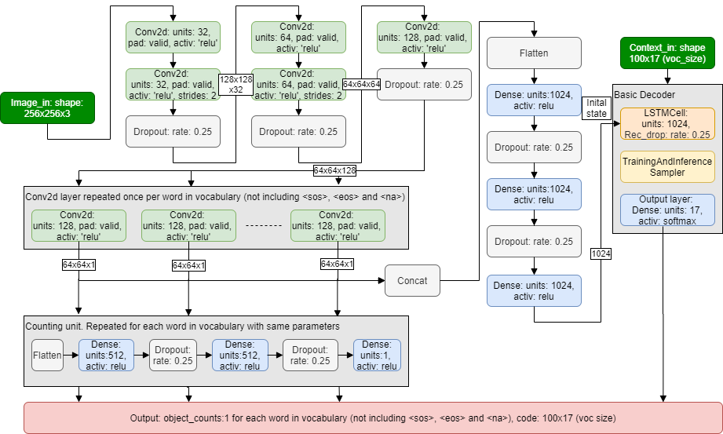

The results are shown below and we can see that the results improve slightly due to the simplified architecture:

| dataset   |      error |   correctly_predicted |   same_length |   active_button_correct |   button_color_correct |
|:----------|-----------:|----------------------:|--------------:|------------------------:|-----------------------:|
| train     | 0          |              1        |      1        |                1        |               1        |
| valid     | 0.00479369 |              0.935294 |      0.982353 |                0.994118 |               0.941176 |
| test      | 0.00546907 |              0.923529 |      0.964706 |                0.994118 |               0.923529 |

As can be seen most of the errors occur due to incorrect identification of the button colors. Studying a few examples of this it could be seen although the CNN part of the model gave the correct output, this was lost to the RNN part. An example (sample D5435D00-A6C9-402B-A27B-5648D8551F1D) is shown below. Note how the btn-green changes to btn-red in prediction, even though the CNN clearly outputs it should be green.
* correct code: "header [ btn-inactive btn-inactive btn-inactive btn-active btn-inactive ] row [ single [ small-title text btn-red ] ] row [ double [ small-title text btn-green ] double [ small-title text btn-orange ] ] row [ quadruple [ small-title text btn-red ] quadruple [ small-title text btn-orange ] quadruple [ small-title text btn-green ] quadruple [ small-title text btn-red ] ]"
* prediction: "header [ btn-inactive btn-inactive btn-inactive btn-active btn-inactive ] row [ single [ small-title text btn-red ] ] row [ double [ small-title text btn-green ] double [ small-title text btn-orange ] ] row [ quadruple [ small-title text btn-red ] quadruple [ small-title text btn-orange ] quadruple [ small-title text btn-red ] quadruple [ small-title text btn-red ] ]"
* image out from CNN: 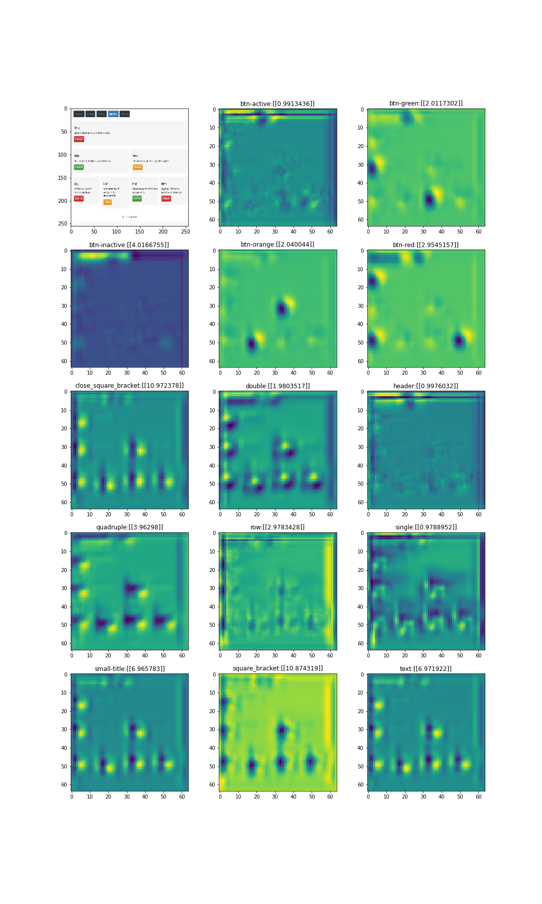

#### Image model TFA repeat
To solve this we went back to a more repeat like architecture where the image data were fed into each LSTM-cell, while keeping the memory. The architecture can be seen below:
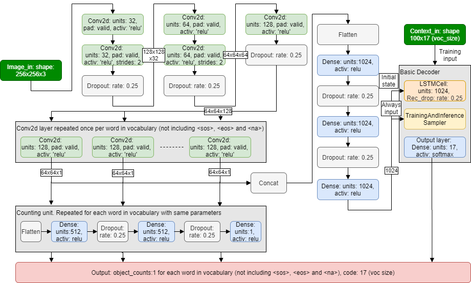

The results are shown below. As can be seen the predictions are considerably better, but still not perfect when it comes to the color of the buttons. It could still be seen that in all the cases the color of the buttons were identified incorrectly, the CNN gave the "right" output.

| dataset   |       error |   correctly_predicted |   same_length |   active_button_correct |   button_color_correct |
|:----------|------------:|----------------------:|--------------:|------------------------:|-----------------------:|
| train     | 8.60689e-06 |              0.99926  |      1        |                       1 |               0.99926  |
| valid     | 0.00329891  |              0.947059 |      0.994118 |                       1 |               0.947059 |
| test      | 0.00286749  |              0.964706 |      0.994118 |                       1 |               0.964706 |

#### Image model TFA repeat bypass
Hence, to improve the model further, the ordering part (the dense units) were bypassed for the image input to the LSTM cells. This did however cause the matrices of the LSTM cells to be massive and not fit in memory. To resolve this the output of the CNN were downsampled using either a maxpool layer or an additional convolutional layer. Moreover, the LSTM-cells themselves were lowered to 512 units.
Architecture using maxpool. For strides, exchange the maxpool layer by a convolutional layer with one feature map as output (and strides 4x4).
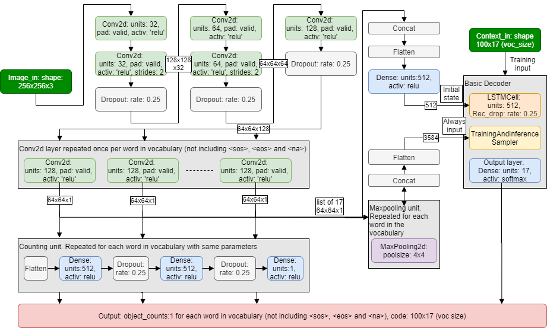

The results were the same for both approaches (maxpool vs strides) and are shown below. 

| dataset   |   error |   correctly_predicted |   same_length |   active_button_correct |   button_color_correct |
|:----------|--------:|----------------------:|--------------:|------------------------:|-----------------------:|
| train     |       0 |                     1 |             1 |                       1 |                      1 |
| valid     |       0 |                     1 |             1 |                       1 |                      1 |
| test      |       0 |                     1 |             1 |                       1 |                      1 |

As can be seen 100% accuracy was achieved. Mission accomplished! 

#### Other models
In the codebase some other models also exists, where the embeddings and attention mechanisms have been incorperated. They were hoever not pursued since the models above gave 100% accuracy for the validation set.
